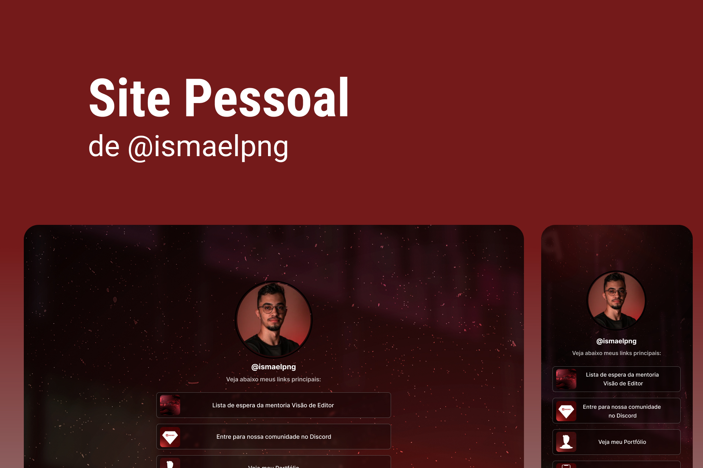

<h1 align="center"> Site Pessoal do Ismael </h1>

Esse site foi criado com foco em replicar e substituir o site pessoal já utilizado pelo Ismael, trazendo autonomia e melhorando a qualidade do UI Design.

  <a href="#-tecnologias">Tecnologias</a>&nbsp;&nbsp;&nbsp;|&nbsp;&nbsp;&nbsp;
  <a href="#-projeto">Projeto</a>&nbsp;&nbsp;&nbsp;|&nbsp;&nbsp;&nbsp;
  <a href="#memo-licença">Licença</a>

  

 

  

## 🚀 Tecnologias

Esse projeto foi desenvolvido com as seguintes tecnologias:

- HTML e CSS
- Git e Github
- Figma

## 💻 Projeto

O site do Ismael é de uso pessoal. Tá a procura de um editor de vídeo? Dá uma olhada lá.

- [Visite o projeto online](https://luad3cristal.github.io/ismaelpng)

## 📝 Licença

Esse projeto está sob a licença MIT.